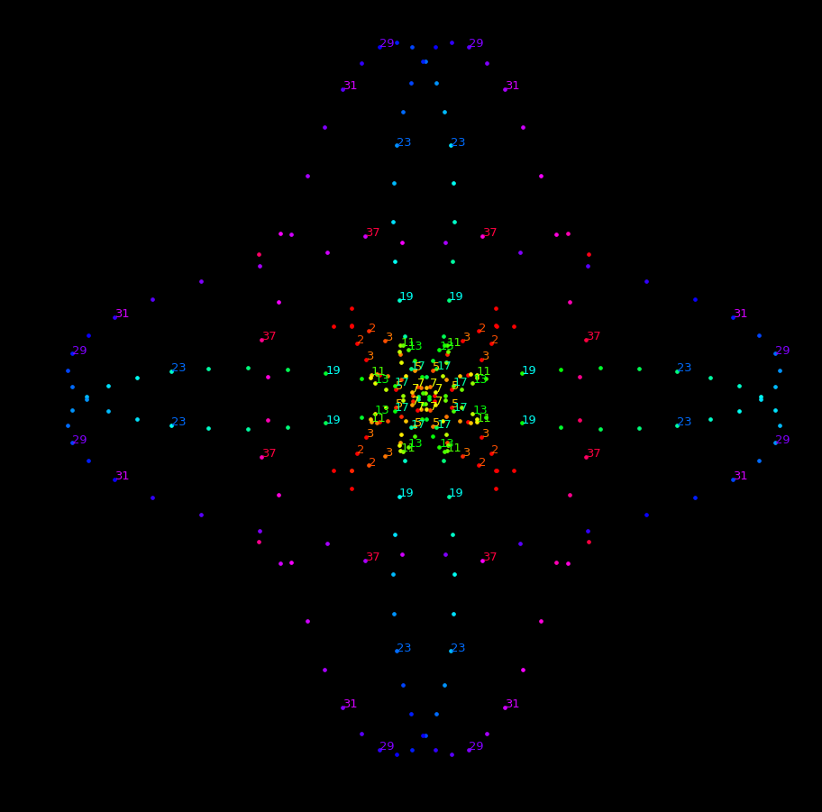
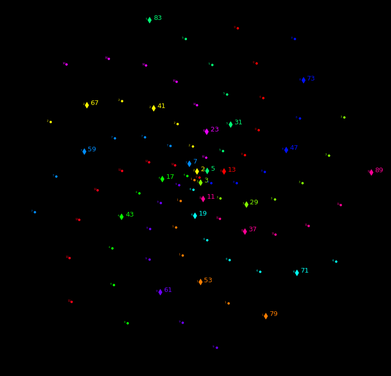
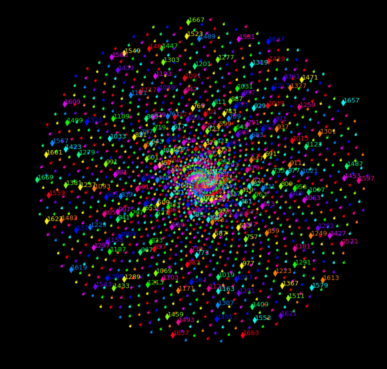

# Solution to the puzzle

https://www.youtube.com/watch?v=NY5tgKBtLQ0

Just for this puzzle, we can try:

$$ T_o  = \frac{1}{2}(1+\sqrt{5})$$

For the selected $T_o$ 'pause-and-ponder' looking for the best possible $T_{mod}$, and $T_{color}$:

$$ \tau = e^{\frac{2\pi i}{T_o}}$$

$$\delta[0]=\delta_0 =\frac{1}{T_o}$$

$$\delta[n] =\begin{cases} \delta_0\space for \space n=0\space mod\space T_{mod} \\
                     0\space for \space n > 0 \space mod\space T_{mod} \\
       \end{cases}$$

$$r[-1]=0$$

$$r[n] = r[n-1] + \delta[n] $$

Time evolves, and becomes interested in modular shapes and closed loops:

$$\hat n[n] =r[n]·\tau^{n}$$

Maybe just an opportunity to share this beautiful map (by Dominic Walliman) :

A primes disc using this structure:

A bigger one (How would you predict the next frame?):

